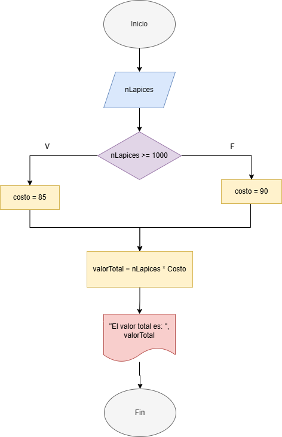
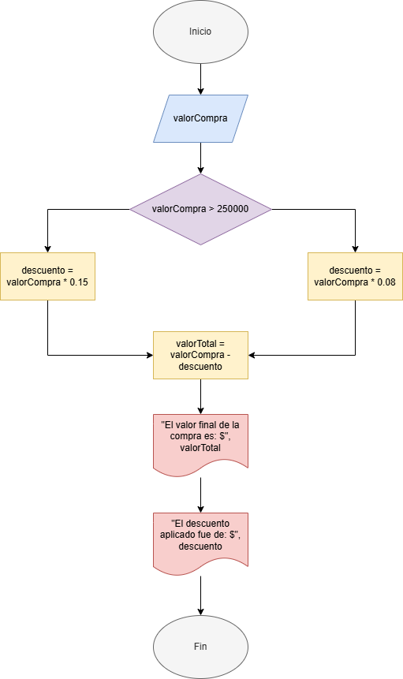

# Algoritmos

## Símbolos que se utilizan para representar cada operación de un algorimo con un diagrama de flujo


## Algoritmo para empresa


## Ejercicios

### Realice un algoritmo para determinar cuánto se debe pagar por equis cantidad de lápices considerando que si son 1000 o más el costo es de $85 cada uno; de lo contrario, el precio es de $90. Represéntelo con el pseudocódigo y el diagrama de flujo.

**Pseudocódigo:**

```
Inicio
Leer nLapices
Si nLapices >= 1000
    Hacer costo = 85
Si no
    Hacer costo = 90
Fin Si
Hacer valorTotal = nLapices * costo
Escribir "El valor total de los lápices es: ", valorTotal
Fin
```

**Diagrama de flujo:** 



**Código:**

```py
nLapices = int(input("Ingresa la cantidad de lápices a comprar: "))

if nLapices >= 1000:
    total = 85 * nLapices
else:
    total = 90 * nLapices
print("El valor de los lápices es: $", total)
```

### Un almacén de ropa tiene una promoción: por compras superiores a $250 000 se les aplicará un descuento de 15%, de caso contrario, sólo se aplicará un 8% de descuento. Realice un algoritmo para determinar el precio final que debe pagar una persona por comprar en dicho almacén y de cuánto es el descuento que obtendrá. Represéntelo mediante el pseudocódigo y el diagrama de flujo.

**Pseudocódigo:**

```
Inicio
Leer valorCompra
Si valorCompra > 250000
    Hacer descuento = valorCompra * 0.15
Si no
    Hacer descuento = valorCompra * 0.08
Hacer valorFinal = valorCompra - descuento
Escribir "El valor final de la compra es: $", valorFinal
Escribir "El descuento fue de: $", descuento
Fin
```
**Diagrama de flujo:**


**Código:**

```py
valorCompra = int(input("Ingrese el valor de la compra: "))

if valorCompra > 250000:
    descuento = 0.15
else:
    descuento = 0.08

valorFinal = valorCompra - (valorCompra * descuento)

print("El valor final de la compra es:", valorFinal, "y el descuento aplicado fue de:", descuento*100, "%")
```

### El director de una escuela está organizando un viaje de estudios, y requiere determinar cuánto debe cobrar a cada alumno y cuánto debe pagar a la compañía de viajes por el servicio. La forma de cobrar es la siguiente: si son 100 alumnos o más, el costo por cada alumno es de $65.00; de 50 a 99 alumnos, el costo es de $70.00, de 30 a 49, de $95.00, y si son menos de 30, el costo de la renta del autobús es de $4000.00, sin importar el número de alumnos.

**Pseudocódigo:**

```
Inicio
Leer nAlumnos
Si nAlumnos < 30
    total = 4000
    precio = total / nAlumnos
Si no
    Si nAlumnos < 50
        precio = 95
    Si no
        Si nAlumnos < 100
            precio = 70
        Si no
            precio = 65
        Fin si
    Fin si
    total = precio * nAlumnos
Fin si
Escribir precio, total
```

## Bucles

### Ejemplo 1:

```py
suma = 0
cont = 1 
while cont <= 10:
    valor = int(input("Ingrese el valor: "))
    suma = suma + valor
    cont = cont + 1
print(f"La suma es: {suma}")
```

### Ejemplo 2:

```py
suma = 0
for cont in range(1,11,1):
    valor = int(input("Ingrese el valor: "))
    suma = suma + valor
print(f"La suma es: {suma}")
```

### Un profesor tiene un salario inicial de $1500, y recibe un incremento de 10% anual durante 6 años. ¿Cuál es su salario al cabo de 6 años? ¿Qué salario ha recibido en cada uno de los 6 años?

#### Análisis

**1. Variables de entrada** No hay

**2. Variables de salida**

- `salario` : El salario del profesor en cada año.

**3. Constantes**

- `salario_inicial` = 1500
- `incremento` = 0.1
- `años` = 6

**4. Otras variables**

- `c` : El contador en la función `for`

**5. Ecuaciones**

- $\textnormal{salario} = \textnormal{salario} + (\textnormal{salario} \cdot \textnormal{incremento})$

#### Pseudocódigo

```
Inicio
salario_inicial = 1500
incremento = 0.1
años = 6
Desde c = 0 hasta c = años
    salario = salario_inicial
    Escribir "El salario el año", c, "Es de ", salario
    salario = salario * incremento
Fin desde
Fin
```

#### Código en Python

```py
salario_inicial = 1500
incremento = 0.1
años = 6
salario = salario_inicial + (salario_inicial * incremento) 
for c in range (1,años,1):
    print(f"El salario el año {c} es de {salario}")
    salario = salario + (salario * incremento)
print(f"El salario al cabo de los 6 años es {salario}")
```

### “El náufrago satisfecho” ofrece hamburguesas sencillas (S), dobles (D) y triples (T), las cuales tienen un costo de $20, $25 y $28 respectivamente La empresa acepta tarjetas de crédito con un cargo de 5 % sobre la compra. Suponiendo que los clientes adquieren N hamburguesas, las cuales pueden ser de diferente tipo, realice un algoritmo para determinar cuánto deben pagar.

#### Análisis

**1. Variables de entrada**

- `S` : Número de hamburguesas sencillas
- `D` : Número de hamburguesas dobles
- `T` : Número de hamburguesas triples

**2. Variables de salida**

- `precio_total`

**3. Constantes**

- `precio_S` = 20
- `precio_D` = 25
- `precio_T` = 28
- `cargo` = 0.05

**4. Otras variables**

- `N`
- `c` : El contador en la función `for`

**5. Ecuaciones**

- 

#### Pseudocódigo

```
Leer S
Leer D
Leer T
N = S + D + T
Desde c = 0 hasta N
    
```
