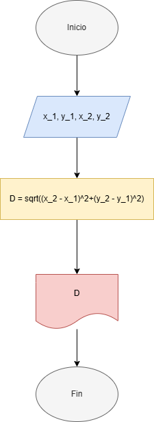

# Problemas

## 1. Se requiere obtener la distancia entre dos puntos en el plano cartesiano, tal y como se muestra en la figura 1. Realice un diagrama de flujo y pseudocódigo que representen el algoritmo para obtener la distancia entre esos puntos


### Análisis

1. Variables de entrada

    - `x_1` : Coordenada en x del punto 1
    - `y_1` : Coordenada en y del punto 1
    - `x_2` : Coordenada en x del punto 2
    - `y_2` : Coordenada en y del punto 2

2. Variables de salida

    - `D` : Distancia entre el punto 1 y 2

3. Constantes no hay

4. Otras variables no hay

5. Ecuaciones

    - `D = sqrt((x_2 - x_1)^2+(y_2 - y_1)^2)`

### Pseudocódigo

```pseudo
Inicio
Leer x_1, x_2, y_1, y_2
D = sqrt((x_2 - x_1)^2+(y_2 - y_1)^2)
Imprimir D
Fin
```

### Diagrama de flujo



## 2. Una modista, para realizar sus prendas de vestir, encarga las telas al extranjero. Para cada pedido, tiene que proporcionar las medidas de la tela en pulgadas, pero ella generalmente las tiene en metros. Realice un algoritmo para ayudar a resolver el problema, determinando cuántas pulgadas debe pedir con base en los metros que requiere. Represéntelo mediante un diagrama de flujo y pseudocódigo (1 pulgada = 0.0254 m)

### Análisis

1. Variables de entrada

    - `medida` : medida de la tela en metros

2. Variables de salida

    - `medida_in` : medida de la tela en pulgadas

3. Constantes

    - `m_in = 0.0254` : factor de conversión de metros a pulgadas

4. Otras variables no hay

5. Ecuaciones

    - `medida_in = medida / m_in`

### Pseudocódigo

```pseudo
Inicio
m_in = 0.0254
Leer medida
medida_in = medida / m_in
Imprimir medida_in
Fin
```

### Diagrama de flujo


## 3. Se requiere determinar la hipotenusa de un triángulo rectángulo. ¿Cómo sería el diagrama de flujo y el pseudocódigo que representen el algoritmo para obtenerla?

### Análisis

1. Variables de entrada

    - `c1` : medida del cateto 1
    - `c2` : medida del cateto 2

2. Variables de salida

    - `h` : medida de la hipotenusa del triángulo

3. Constantes no hay

4. Otras variables no hay

5. Ecuaciones

    - `h = sqrt((c1)^2+(c2)^2)`

### Pseudocódigo

```pseudo
Inicio
Leer c1, c2
h = sqrt((c1)^2+(c2)^2)
Imprimir h
Fin
```

### Diagrama de flujo


## 4. Se requiere determinar la edad actual de una persona basándose en su fecha de nacimiento. Además, es necesario establecer si la persona ya ha cumplido años en el año en curso, si aún no lo ha hecho, o si hoy es su cumpleaños, para celebrarlo. La fecha de nacimiento y la fecha actual estarán representadas mediante tres variables: día, mes y año

- Diseñe un algoritmo que permita calcular la edad de la persona.

- Dentro de la solución, determine si la persona ya celebró su cumpleaños este año o si aún no lo ha hecho.

- Verifique si la fecha actual corresponde al día de su cumpleaños. De ser así, imprima el mensaje “Feliz Cumpleaños”.

### Análisis

1. Variables de entrada

    - `dia_h` : Día de la fecha actual
    - `mes_h` : Mes de la fecha actual
    - `ano_h` : Año de la fecha actual
    - `dia_c` : Día de la fecha del cumpleaños
    - `mes_c` : Mes de la fecha del cumpleaños
    - `ano_c` : Año de la fecha del cumpleaños

2. Variables de salida

    - `edad` : Edad calculada del usuario

3. Constantes no hay

4. Otras variables

    - `celebro` : Es un valor que dice si es verdadero o falso que el usuario ya celebró su cumpleaños este año

5. Ecuaciones

    - `edad = ano_h - ano_c`
    - `edad = edad - 1`

### Pseudocódigo

```pseudo
Inicio
Leer dia_h, mes_h, ano_h, dia_c, mes_c, ano_c
celebro = 0
edad = ano_h - ano_c
Si mes_h < mes_c
    edad = edad - 1
Si no Si mes_h = mes_c
    Si dia_h < dia_c
        edad = edad - 1
    Si no Si dia_h = dia_c
        Imprimir "Feliz cumpleaños!🥳🎉"
    Si no
        celebro = 1
    Fin Si
Si no
    celebro = 1
Fin si
Imprimir edad
Si celebro = 1
    Imprimir "El usuario ya cumplió años este año"
Fin si
Fin
```

### Diagrama de flujo


## 5. Realice un algoritmo que permita determinar el sueldo semanal de un trabajador con base en las horas trabajadas y el pago por hora, considerando que a partir de la hora número 41 y hasta la 45, cada hora se le paga el doble, de la hora 46 a la 50, el triple, y que trabajar más de 50 horas no está permitido. Represente el algoritmo mediante pseudocódigo

### Análisis

1. Variables de entrada

    - `horas` : Horas trabajadas esa semana
    - `sueldoH` : Pago por hora

2. Variables de salida

    - `sueldoS` : Sueldo semanal

3. Constantes no hay

4. Otras variables no hay

5. Ecuaciones

    - `horas_triple = horas - 45`
    - `horas_doble = horas - 40`
    - `sueldoS = (horas_normal * sueldoH) + (horas_doble * sueldoH * 2) + (horas_triple * sueldoH * 3)`

### Pseudocódigo

```pseudo
Inicio
horas_normal = 0
horas_doble = 0
horas_triple = 0
Leer horas, sueldoH
Si 47 <= horas <= 50
    horas_normal = 45
    horas_doble = 5
    horas_triple = horas - 45
Si no si 41 <= horas <= 45
    horas_normal = 45
    horas_doble = horas - 40
Si no si horas <= 40
    horas_normal = horas
Si no
    Imprimir "Número de horas inválido"
sueldoS = (horas_normal * sueldoH) + (horas_doble * sueldoH * 2) + (horas_triple * sueldoH * 3)
Si horas <= 50
    Imprimir sueldoS
Fin
```

## 6. Se requiere un algoritmo para determinar, de N cantidades, cuántas son cero, cuántas son menores a cero, y cuántas son mayores a cero. Realice el pseudocódigo para representarlo, utilizando el ciclo apropiado

### Análisis

1. Variables de entrada

    - `nCantidades` : El número de cantidades que el usuario quiere definir.

2. Variables de salida

    - `mayor` : Contador de números mayores que cero.
    - `menor` : Contador de números menores que cero.
    - `cero` : Contador de números iguales a cero.

3. Constantes no hay

4. Otras variables

    - `c` : El contador de números.

5. Ecuaciones

    - `mayor = mayor + 1`
    - `menor = menor + 1`
    - `cero = cero + 1`

### Pseudocódigo

```pseudo
Inicio
Leer nCantidades
mayor = 0
menor = 0
cero = 0
Desde c = 1 hasta c = nCantidades
    Leer numero
    Si numero > 0
        mayor = mayor + 1
    Si no si numero < 0
        menor = menor + 1
    Si no
        cero = cero + 1
    Fin si
Fin Desde
Imprimir "Hay ", menor, "números menores que cero, " mayor, "números mayores que cero y " cero, "números iguales a cero"
Fin
```

## 7. Se requiere un algoritmo para determinar cuánto ahorrará en pesos una persona diariamente, y en un año, si ahorra 3¢ el primero de enero, 9¢ el dos de enero, 27¢ el 3 de enero y así sucesivamente todo el año. Represente la solución mediante pseudocódigo

### Análisis

1. Variables de entrada no hay

2. Variables de salida

    - `ahorro_p` : Da los valores de ahorro en pesos

3. Constantes no hay

4. Otras variables

    - `c` : El contador de números.
    - `ahorro` : Acumula el ahorro cada día.
    - `ahorro_diario` : Da el ahorro que se sumó cada día.
    - `ahorro_dp` : Da el ahorro sumado cada día en pesos.
    - `ahorro_p` : Da el ahorro acumulado en pesos.

5. Ecuaciones

    - `ahorro_dp = ahorro_diario / 100`
    - `ahorro_diario = 3^(c+1)`
    - `ahorro = ahorro + ahorro_diario`
    - `ahorro_p = ahorro / 100`

### Pseudocódigo

```pseudo
Inicio
ahorro = 3
ahorro_diario = ahorro
Desde c = 1 hasta c = 364
    ahorro_dp = ahorro_diario / 100
    Imprimir "El ahorro el día ", c, "fue de $", ahorro_dp
    ahorro_diario = 3^(c+1)
    ahorro = ahorro + ahorro_diario
Fin Desde
ahorro_p = ahorro / 100
Imprimir "Al final del año, el usuario ahorrará", ahorro_p
Fin
```

## 8. Realice el algoritmo para determinar cuánto pagará una persona que adquiere N artículos, los cuales están de promoción. Considere que si su precio es mayor o igual a $200 se le aplica un descuento de 15%, y si su precio es mayor a $100, pero menor a $200, el descuento es de 12%; de lo contrario, solo se le aplica 10%. Se debe saber cuál es el costo y el descuento que tendrá cada uno de los artículos y finalmente cuánto se pagará por todos los artículos obtenidos. Represente la solución mediante pseudocódigo

### Análisis

1. Variables de entrada

    - `nArticulos` : Número de artículos a comprar
    - `cArticulo` : Costo de cada artículo a comprar

2. Variables de salida

    - `total` : Precio final de la compra

3. Constantes no hay

4. Otras variables

    - `c` : El contador de números.

5. Ecuaciones

    - `total = total + (cArticulo * descuento)`

### Pseudocódigo

```pseudo
Inicio
total = 0
Leer nArticulos
Desde c = 1 hasta c = nArticulos
    Leer cArticulo
    Si cArticulo >= 200
        descuento = 0.85
    Si no si 100 < cArticulo < 200
        descuento = 0.88
    Si no
        descuento = 0.90
    Fin si
    total = total + (cArticulo * descuento)
Fin Desde
Imprimir total
Fin
```

## 9. Realice un algoritmo y represéntelo mediante pseudocódigo para obtener una función exponencial, la cual está dada por: $e^{x}=1+\frac{x}{1!}+\frac{x^{2}}{2!}+\frac{x^{3}}{3!}+\dots$

### Análisis

1. Variables de entrada

    - `x` : El número al que se quiere elevar la función exponencial.
    - `nIteraciones` : Es el número de iteraciones con el que usuario quiere que se aproxime el resultado.

2. Variables de salida

    - `eX` : Es el resultado de la aproximación de la operación.

3. Constantes no hay

4. Otras variables

    - `n` : El contador de números.
    - `e_n` : Es el resultado de cada iteración del bucle.

5. Ecuaciones

    - `e_n = (x^n)/(n!)`
    - `eX = eX + e_n`

### Pseudocódigo

```pseudo
Inicio
Leer x
Leer nIteraciones
eX = 0
Desde n = 0 hasta n = (nIteraciones - 1)
    e_n = (x^n)/(n!)
    eX = eX + e_n
Fin Desde
Imprimir eX
Fin
```

## 10. Realice un algoritmo para obtener el seno de un ángulo y represéntelo mediante pseudocódigo. Utilice la siguiente ecuación: $\sin{x}=x-\frac{x^{3}}{3!}+\frac{x^{5}}{5!}-\frac{x^{7}}{7!}+\dots$

### Análisis

1. Variables de entrada

    - `x` : El número al que se quiere sacar el seno.
    - `nIteraciones` : Es el número de iteraciones con el que usuario quiere que se aproxime el resultado.

2. Variables de salida

    - `sin_x` : Es el resultado de la aproximación de la operación.

3. Constantes no hay

4. Otras variables

    - `n` : El contador para el bucle desde.
    - `c` : El contador para la operación.
    - `sin_n` : Es el resultado de cada iteración del bucle.

5. Ecuaciones

    - `sin_n = (x^c)/(c!)`
    - `sin_x = sin_x - sin_n`
    - `sin_x = sin_x + sin_n`
    - `c = c + 2`

### Pseudocódigo

```pseudo
Inicio
Leer x
Leer nIteraciones
sin_x = 0
c = 1
Desde n = 1 hasta n = nIteraciones
    sin_n = (x^c)/(c!)
    Si Residuo(n,2) = 0
        sin_x = sin_x - sin_n
    Si no
        sin_x = sin_x + sin_n
    Fin si
    c = c + 2
Fin desde
Imprimir sin_x
Fin
```
